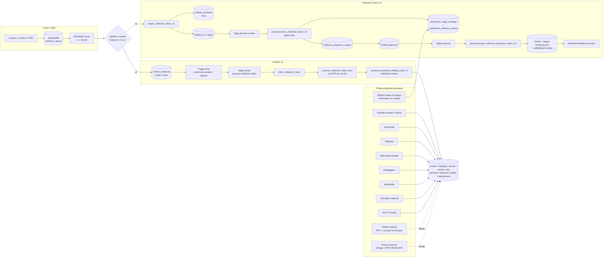

# AC-Prod2 MES vNext — AS-IS e mapa de dependências

**Data de referência:** 2026-09-04

**Base auditada:** `origin/main` em `9174c796df4fa008507e727eb35cce63b3e4a08f`

**Branch de auditoria:** `codex/mes-vnext-audit-20260904`

**Escopo deste documento:** inventário estático e rastreamento de chamadas no repositório. Nenhuma flag foi habilitada, nenhum teste de carga foi executado e nenhum dado foi alterado.

> `CATALOG_REQUIRED` significa que a conclusão depende da definição efetiva, owner, grant, policy, trigger, índice ou overload existente no projeto Supabase. Nesses casos, as migrations mostram intenção ou dependência, mas não são suficientes para afirmar o estado runtime.

## 1. Conclusão executiva

O código atual não possui uma única fronteira canônica de decisão produtiva por recibo. A coleta rastreável tem duas pipelines, mas entrada manual, volume não rastreável, reposição, marcenaria legada, rejeição, liberação especial, embalagem e expedição conservam trilhas próprias de escrita. Algumas delas não criam `coletas_producao`, `production_collection_events` ou `collection_projection_outbox`.

Os principais bloqueadores observados são:

1. A implementação efetiva de `process_production_reading_impl_v2` não está
   integralmente versionada nas migrations. Ela foi extraída literalmente do
   runtime nesta auditoria: além de receipt/event/reading, escreve compatibilidade
   legacy e atualiza peça, lote, célula/contexto e agregados no mesmo hotpath
   ([captura runtime](runtime-critical-function-definitions.sql.txt)). Ainda não é
   desired state nem está homologada.
2. O histórico versionado contém duas definições de índice de aprovação:
   `(piece_id, step_name)` e `(piece_id, step_name, production_cycle)`, sem
   reproduzir claramente a remoção da primeira. O catálogo runtime mantém
   somente a barreira parcial com ciclo. O bloqueio atual é o drift de
   reprodutibilidade e o uso de `step_name` literal, não a coexistência dos dois
   índices no banco observado
   (`supabase/migrations/20260728100000_fix_replacement_uq_approved_item_step_constraint.sql:7-11`;
   `supabase/migrations/032_collection_realtime_multi_operator.sql:253-281`;
   [catálogo runtime](02-runtime-baseline-and-catalog.md#52-evento-e-ledger)).
3. O runtime confirma grants de escrita a `authenticated` e a policy
   `stage_readings_insert` permite inserção a admin, manager e operator sem
   restringir peça, célula ou setor. Um cliente autenticado elegível pode inserir
   `approved` diretamente no ledger, fora de rota, recibo, resultado e outbox
   ([catálogo runtime](02-runtime-baseline-and-catalog.md#83-grants-excessivos)).
4. `CollectionPage` e `Entry` encerram a sessão operacional no unmount; timeout ou falha transitória do profile também pode limpar Auth e chamar `signOut` (`src/pages/CollectionPage.jsx:12-17`; `src/pages/Entry.jsx:58-63`; `src/lib/AuthContext.jsx:67-124,185-209,242-266,375-392`).
5. `production_entries`, `production_events` e os campos de estado de peça/lote misturam fatos legados, projeções e mutações administrativas. Eles não podem ser apagados e reconstruídos como um conjunto homogêneo.
6. A v3 desloca trabalho para outbox/projetor, mas o projetor ainda aplica cada mensagem em loop e executa vários efeitos compartilhados por item, em vez de deltas set-based agrupados (`supabase/migrations/20260901124000_collection_fabric_v3_projector.sql:176-248,286-552`).

As quatro flags v3 são criadas desligadas e devem permanecer assim até a auditoria runtime, testes e GO formal (`supabase/migrations/20260901120000_collection_fabric_v3_foundation.sql:101-121`).

## 2. Diagrama AS-IS

### Dependências da trilha rastreável

- A tela persiste a leitura e agenda envio em `src/pages/TraceabilityCollection.jsx:593-713`.
- Eventos `production_stage` usam microbatch por padrão; o retorno imediato de `processNow` é `PENDING_DATABASE`, não ACK do banco (`src/hooks/useCollectionQueue.js:193-202,700-747`).
- O dispatcher agrupa somente eventos produtivos consecutivos; reposição segue RPC próprio (`src/lib/collectionEventDispatcher.js:96-137`).
- O cliente escolhe v2/v3, fixa a versão e não faz fallback após uma fronteira incerta (`src/lib/collectionBatchService.js:610-680`; `src/lib/collectionEventQueue.js:541-650`).
- Na v2, o frontend insere receipts e polla a finalização por até 15 segundos (`src/lib/collectionBatchService.js:458-555`). O worker Edge faz um RPC por receipt (`supabase/functions/process-collection-inbox/index.ts:143-197`).
- Na v3, o ingress autentica, valida lote de até 25 eventos, grava receipts e envia cada referência para PGMQ (`supabase/migrations/20260901121000_collection_fabric_v3_queues_ingress.sql:89-655`). O worker chama um processador batch (`supabase/functions/process-collection-v3/index.ts:138-171`; `supabase/migrations/20260901123000_collection_fabric_v3_decision_processor.sql:330-1070`).
- A decisão v3 grava ledger, resultado e outbox; o projector aplica shards, compatibilidade legacy, lifecycle e Broadcast depois (`supabase/migrations/20260901123000_collection_fabric_v3_decision_processor.sql:741-920`; `supabase/migrations/20260901124000_collection_fabric_v3_projector.sql:286-590`).
- A função v3 canônica atual recebe um conjunto de itens e identidade de worker. Não existe uma função privada por receipt compartilhada entre RPC síncrono, fallback, replay e reconciliação.

## 3. Mapa dos fluxos produtivos

| Fluxo | Entrypoint frontend | Serviço / RPC | Fatos e projeções afetados | Observações e caminhos alternativos |
|---|---|---|---|---|
| Leitura rastreável | Rota `/coleta`: `src/App.jsx:159`; `src/pages/CollectionPage.jsx:9-53`; handler em `src/pages/TraceabilityCollection.jsx:593-713` | IndexedDB → `dispatchCollectionEventBatch` → v2 receipt ou `ingest_collection_batch_v3` (`src/lib/collectionEventDispatcher.js:96-137`; `src/lib/collectionBatchService.js:566-680`) | Receipt em `coletas_producao`; decisão em `production_stage_readings` e `production_collection_events`; v3 cria `collection_projection_outbox` | Caminho individual ainda chama `process_production_reading` diretamente quando não está no microbatch/fast path (`src/lib/collectionEventDispatcher.js:19-63`; `src/lib/fastProductionReadingService.js:16-78`; `src/lib/traceabilityService.js:268-322`). |
| Entrada manual legada | `/entrada` e alias `/baixa-manual`: `src/App.jsx:127,160`; `src/pages/Entry.jsx:129-245` | `processManualProductionEntry` → CRUD direto `ProductionEntry` (`src/lib/productionEntryService.js:11-270`; `src/lib/localDb.js:23,265-388`) | `production_entries`; audit de correção em trilha separada | Offline usa `localStorage`, ID temporário e não possui idempotência/auditoria forte (`src/hooks/useOfflineSync.js:2-57`; `src/lib/offlineQueue.js:2-56`). |
| Quantidade não rastreável | `src/pages/ManualProductionEntryPage.jsx:103-160`; painel em `src/components/collection/CollectionVolumeEntryPanel.jsx:124-168` | `registerManualQuantitativeEntry` → `register_untraceable_production_entry` (`src/lib/manualProductionService.js:34-91`) | `production_entries` + `manual_production_records`; atualiza estado/KPIs de lote e batch | Não cria reading, collection event ou outbox. O RPC faz scans e updates de lifecycle na mesma transação (`supabase/migrations/20260729011000_manual_volume_daily_goals_and_report_recovery.sql:417-615`). |
| Reposição | `/reposicao`: `src/App.jsx:164`; `src/pages/ReplacementStationPage.jsx:335-450` | Fila local `replacement_stage` → `collectReplacementStageV2` → `collect_replacement_stage_v3` (`src/lib/replacementService.js:353-375`; `src/lib/collectionEventDispatcher.js:23-36`) | Reading approved, collection event, audit, peças, replacement order, lote e Broadcast | O wrapper delega ao v2 (`supabase/migrations/20260811135542_replacement_operator_access.sql:281-322`). A função transacional é independente do processador normal e recalcula o lote sincronicamente (`supabase/migrations/20260810031012_replacement_station_transactional_v2.sql:726-1218`, recálculo em `396-503`). |
| Retrabalho | Serviço sem caller produtivo encontrado: `src/lib/reworkService.js:34-52` | `create_rework_order` | Original bloqueada, nova peça, rework order e `production_events` | O serviço envia `rework_reason_code`, mas SQL lê `reason_code` (`supabase/migrations/028_mes_evolution_modules.sql:662-805`). O RPC cria a nova peça, mas não aprova. A barreira runtime inclui `production_cycle`; ainda faltam caller produtivo e teste que prove novo ciclo, rota e normalização canônica. |
| Rejeição | Modal em `src/pages/TraceabilityCollection.jsx:715-788` | `rejectPieceFromCollection` → `register_quality_rejection` (`src/lib/collectionService.js:599-680`) | Reading rejected, occurrence/NC, peça rejeitada, replacement order | A função final recebe IDs de contexto do payload e sempre procura/cria reposição (`supabase/migrations/20260726100000_fix_replacement_flow_schema.sql:134-205`). Outro serviço possui fallback direto que atualiza peça e insere reading, depois retorna sucesso sem validar ambos os erros (`src/lib/traceabilityService.js:324-357`). |
| Correção | Correção de entrada em `src/pages/Entry.jsx:248-285`; integridade/liberação em `src/pages/LotIntegrity.jsx:600-628` | CRUD direto de `production_entries`; `authorize_special_release`; trigger de correction v3 | `production_entries`, audit log; `flow_exceptions`, campos da peça e `production_events`; outbox somente quando `production_stage_readings.status` é atualizado | Correção legada não compensa ledger/outbox. Liberação especial acrescenta `completed_steps` sem reading (`supabase/migrations/030_lot_integrity_flow_control.sql:798-858`). Trigger v3 produz outbox compensatório, mas não foi localizado um entrypoint produtivo que atualize o ledger (`supabase/migrations/20260901123000_collection_fabric_v3_decision_processor.sql:1095-1265`). |
| Encerramento | `LotIntegrity`, coleta, volume, reposição, embalagem e expedição | Vários updates/RPCs | `production_lots`, `production_orders`, peças, lot items, batch progress | Existem múltiplas autoridades de fechamento. `LotIntegrity` atualiza status diretamente (`src/pages/LotIntegrity.jsx:568-578`). “Encerrar hora” em `Entry` é apenas estado local (`src/pages/Entry.jsx:115-127`). |
| Embalagem | `/embalagem`: `src/App.jsx:161`; `src/pages/PackagingPage.jsx:227-320` | CRUD direto + `scan_piece_to_volume` (`src/lib/packingService.js:17-264`) | `packing_volumes`, items/scans, peça e `production_events`; lote `packed` | Remoção, fechamento e reabertura são sequências de chamadas, não uma transação. O RPC de scan não cria stage reading, receipt ou outbox (`supabase/migrations/036_customer_cover_multi_lot.sql:370-465`). A tela pode atualizar lote para `packed` diretamente (`src/pages/PackagingPage.jsx:286-320`). |
| Expedição | `/expedicao`: `src/App.jsx:162`; `src/pages/ShippingPage.jsx:172-272` | Checklist/upsert, scan RPC e release multichamada (`src/lib/shipmentService.js:16-153,191-344`) | Shipments/items/scans/exceptions, cover, lot events, lot/order e peças completed | Release não é transacional nem protegido como uma única operação idempotente. `update_production_lot_status_safely` muda lot/order para shipped sem autorização explícita no corpo versionado (`supabase/migrations/028_mes_evolution_modules.sql:367-420`). |
| Marcenaria | `/marcenaria`: `src/App.jsx:169`; `src/components/traceability/JoineryWorkbench.jsx:1-116` | Peça moderna chama `process_production_reading` (`src/lib/manualJoineryService.js:59-90`); item legacy insere `lot_step_events` diretamente (`src/components/traceability/JoineryWorkbench.jsx:69-116`) | Reading/evento moderno ou ledger paralelo `lot_step_events` | Dois modelos de verdade na mesma tela. O caminho legacy considera o evento `finish` como conclusão sem passar pela barreira de stage reading. |
| Histórico | `/rastreabilidade/historico` → timeline (`src/App.jsx:145`; `src/pages/Traceability.jsx:19-28,145-170`) | Queries em `lot_step_events`, `production_stage_readings`, `get_collection_history` e count | Somente leitura nessa aba | `LotTimeline` combina dois ledgers no cliente (`src/components/traceability/LotTimeline.jsx:36-84`). O painel recente abre canal próprio e refaz as RPCs (`src/components/collection/CollectionRecentReadsPanel.jsx:63-185`). O status exibido pode ser recalculado a partir do estado mutável da peça (`src/lib/collectionService.js:489-496`). |
| Importação PCP padrão | `src/components/promob/PcpImportTab.jsx:369-505` | Inserts/updates de batch/chunks + `commit_pcp_import` | Orders, lots, import rows, lot items, pieces, tags, lot/batch progress | O RPC de 9 argumentos processa cada chunk e recalcula agregados (`supabase/migrations/032_collection_realtime_multi_operator.sql:1215-1640`); timeout configurado em 55 s (`supabase/migrations/20260831155000_pcp_import_timeout_resilience_v8_6.sql:31-33`). |
| Importação PCP XML/Promob | `src/components/promob/XmlImportTab.jsx:571-652` | Edge `promob-parse-order` / `promob-import-xml` | Storage, import batch, order, lot, lot items, tags e logs | O importador usa identidade de serviço após validar o JWT, mas grava artefatos em múltiplas chamadas; falha intermediária pode deixar estado parcial (`supabase/functions/promob-import-xml/index.ts:152-175,298-333,379-508`). Não cria receipt/outbox. |
| Exclusão de importação Promob | `src/pages/PromobIntegration.jsx:173-291` | Remove storage → `delete_promob_import_batch`; se o RPC falhar, cascata de deletes pelo browser | Pode remover readings, stage facts, collection/production events, peças, lotes, OPs, backups, rows e logs | A remoção do arquivo ocorre antes do RPC. O fallback faz chamadas independentes e ignora resultados intermediários (`src/pages/PromobIntegration.jsx:204-285`), podendo apagar ledger/evidências e deixar estado parcial. É incompatível com a política de preservação vNext. |
| Reset de produção | rota autenticada `/downloads-backups`; zona visual de admin (`src/App.jsx:116-177`; `src/pages/DownloadsBackups.jsx:39-52,614-688`) | Lista/remove arquivos do Storage e depois chama `reset_production_data` (`src/pages/DownloadsBackups.jsx:59-103`) | A implementação runtime faz `TRUNCATE ... RESTART IDENTITY CASCADE` sobre múltiplos fatos, mas preserva receipts | A proteção visual não substitui autorização server-side; Storage pode ser removido mesmo se o RPC falhar. Nunca executar na auditoria/capacity e retirar do alcance comum antes de GO. |

## 4. Caminhos capazes de aprovar ou concluir a mesma peça

### 4.1 Aprovação física em `production_stage_readings`

1. **Coleta individual v2/legacy:** `process_production_reading` é chamado pelo fast path e por callers diretos (`src/lib/fastProductionReadingService.js:60-78`; `src/lib/manualJoineryService.js:59-90`). O wrapper e a implementação efetivos foram extraídos literalmente do runtime; além do ledger, escrevem compatibilidade e recalculam estados no hot path ([captura runtime](runtime-critical-function-definitions.sql.txt)).
2. **Receipt v2 assíncrono:** receipt → `process_collection_inbox_item` → `process_production_reading_v2` (`supabase/migrations/20260831221753_collection_async_inbox_worker_v8_7.sql:221-394`). Converge para a implementação runtime, mas não para uma função por-receipt compartilhada com v3.
3. **Worker v3:** `private.process_collection_batch_v3` resolve, trava e insere o reading (`supabase/migrations/20260901123000_collection_fabric_v3_decision_processor.sql:422-769`). O ciclo é escrito como 1 no fluxo atual.
4. **Reposição:** `collect_replacement_stage_v2` insere reading approved e atualiza peça/order (`supabase/migrations/20260810031012_replacement_station_transactional_v2.sql:918-1078`).
5. **Conclusão forçada de reposição:** a UI chama
   `force_complete_piece_replacement` (`src/pages/ReplacementPage.jsx:343-367`;
   `src/lib/replacementService.js:297-305`). O wrapper runtime delega ao impl
   privilegiado, que insere readings `approved` classificados como
   `manual_adjustment` para as etapas faltantes e conclui a peça/order
   ([captura runtime](runtime-critical-function-definitions.sql.txt);
   `supabase/migrations/20260831143323_reconcile_replacement_workflow_v8_3.sql:45-70`).
6. **Aprovação/liberação administrativa de reposição:** a UI chama
   `approve_piece_replacement` (`src/lib/replacementApprovalService.js:33-48`;
   `src/lib/replacementService.js:268-283`). No runtime atual a aprovação cria e
   libera a peça substituta, mas o contrato checado proíbe inserir reading/event
   nesse passo (`supabase/migrations/20260831143323_reconcile_replacement_workflow_v8_3.sql:218-250`). Não é uma aprovação física de etapa, mas é autoridade paralela de estado que a v4 deve preservar/testar.
7. **Inserção direta autenticada:** confirmada pelos grants/policy do runtime
   descritos na seção 1. Bypassa regra, receipt, resultado e outbox.
8. **RPC manual legado:** `register_manual_quantitative_production` cria peça
   sintética e aprova uma ou todas as etapas
   (`supabase/migrations/052_manual_pcp_cascade_baixa.sql:8-277`). O frontend
   atual não o chama. O runtime confirma o overload `SECURITY DEFINER` e
   `EXECUTE` efetivo para `authenticated`/serviço
   ([inventário](runtime-security-definer-inventory.md)); a autorização
   semântica interna ainda está `REVIEW_REQUIRED`.
9. **Dados de teste:** `seedTestData` insere readings diretamente (`src/lib/seedTestData.js:510-513`). O painel correspondente não apareceu nas rotas de produção, mas a superfície deve ser removida ou isolada antes do GO.

### 4.2 Conclusão lógica fora do ledger

- Marcenaria legacy grava `lot_step_events` (`src/components/traceability/JoineryWorkbench.jsx:69-116`).
- Liberação especial modifica `completed_steps` e desbloqueia a peça sem criar reading (`supabase/migrations/030_lot_integrity_flow_control.sql:827-855`).
- Embalagem muda `current_stage/status` da peça e o lote para `packed` (`supabase/migrations/036_customer_cover_multi_lot.sql:442-461`; `src/pages/PackagingPage.jsx:286-320`).
- Expedição muda lote/order e faz update em massa de peças para `completed` (`src/lib/shipmentService.js:191-289`).
- Rejeição possui fallback de escrita direta em peça/reading (`src/lib/traceabilityService.js:324-357`).

Essas trilhas não necessariamente inserem uma segunda aprovação física, mas podem produzir um estado de negócio equivalente a avanço/conclusão sem o mesmo conjunto de invariantes.

### 4.3 Barreiras existentes e lacunas

- `production_stage_readings.client_event_id` é único quando presente; `production_collection_events.client_event_id` também é único (`supabase/migrations/018_operational_login_and_collection_reliability.sql:109-154`).
- `coletas_producao(device_id, device_sequence)` é único quando ambos existem (`supabase/migrations/20260901120000_collection_fabric_v3_foundation.sql:60-74`).
- A migration histórica mais antiga define `(piece_id, step_name)` e a
  posterior adiciona `production_cycle`
  (`supabase/migrations/20260728100000_fix_replacement_uq_approved_item_step_constraint.sql:9-11`;
  `supabase/migrations/032_collection_realtime_multi_operator.sql:279-281`).
  No corte runtime, somente a barreira parcial com
  `(piece_id, step_name, production_cycle)` está ativa; as duas definições
  coexistem no histórico Git, não no catálogo efetivo.
- Um `client_event_id` repetido é protegido, mas dois IDs distintos para a mesma peça dependem exclusivamente da barreira física e da uniformidade de `step_name`/ciclo entre todos os caminhos.
- A fila local fixa apenas versões 2 ou 3 (`src/lib/collectionEventQueue.js:541-590`), e o banco restringe receipts a pipeline 2/3 e source mode `live`/`offline_replay` (`supabase/migrations/20260901120000_collection_fabric_v3_foundation.sql:38-74`). Uma semântica incompatível exige v4 aditiva.

## 5. Fontes de verdade e projeções

### 5.1 Fatos que devem ser preservados

| Categoria | Objetos | Papel |
|---|---|---|
| Recibo e transporte | `coletas_producao` | ACK durável, identidade do evento, pipeline fixada e estado de processamento. Não é, isoladamente, aprovação produtiva. |
| Ledger físico | `production_stage_readings` | Fato por peça/etapa/ciclo. A própria migration o descreve como histórico imutável (`supabase/migrations/010_traceability_collection_rfid.sql:538-540`); a view `collection_stage_facts` deriva aprovações dele (`supabase/migrations/040_collection_kpi_history_general_lot_reconciliation.sql:6-30`). |
| Resultado de coleta | `production_collection_events` | Resultado/idempotência/auditoria da coleta; deve permanecer ligado a receipt/reading quando aplicável. |
| Entrega durável | `collection_projection_outbox`, `collection_processing_attempts`, filas/archives/DLQs PGMQ | Intenção de projeção, tentativas e recuperação. Não apagar em rollback. |
| Identidade e autorização | `auth.users`, `profiles`, `operators`, `operator_sessions`, assignments de célula/máquina/posto | Contexto deve ser resolvido no servidor. |
| Cadastro produtivo | `production_orders`, `production_lots`, `production_lot_items`, `production_pieces`, rotas e tags | Identidade, relacionamento e roteiro. Alguns campos de progresso nesses objetos são projeções/mutações mistas. |
| Produção manual | `manual_production_records`; linhas manuais/legacy de `production_entries` | Fatos agregados que não podem ser regenerados a partir de readings individuais. |
| Qualidade/reposição/retrabalho | NCs, occurrences, `replacement_orders`, `rework_orders` e logs de ação | Evidência de domínio e transições administrativas. |
| Embalagem/expedição | volumes, items, packing scans, shipments, shipment items/scans/exceptions | Fatos físicos próprios dessas fases. |
| PCP | import batches, rows/chunks/manifests, arquivo-fonte e logs | Evidência da origem e materialização do cadastro produtivo. |

### 5.2 Projeções reconstruíveis

- `production_lot_stage_counter_shards` e `production_lot_stage_counter_totals_v3` (`supabase/migrations/20260901120000_collection_fabric_v3_foundation.sql:218-250`).
- `production_realtime_counters`; a migration o declara derivado/reconstruível (`supabase/migrations/023_realtime_machine_fast_collection.sql:98-145,341`).
- Agregados de etapa/lote e `production_cell_lot_states`, desde que as regras e funções efetivas sejam capturadas antes da reconstrução. `CATALOG_REQUIRED`
- Campos de progresso/KPI em lotes, lot items e PCP batches, desde que separados de transições administrativas não deriváveis.
- Snapshots/views de dashboard, caches React Query e mensagens Broadcast.

### 5.3 Estruturas mistas — não reconstruir ou limpar em bloco

- `production_entries`: contém fato manual/legacy e também projeção v3 (`supabase/migrations/20260901124000_collection_fabric_v3_projector.sql:338-449`).
- `production_events`: recebe eventos nativos de liberação/rework/pack/ship e projeção v3 (`supabase/migrations/20260901124000_collection_fabric_v3_projector.sql:452-488`).
- `lot_step_events`: é ledger legacy consumido por histórico, marcenaria e expedição, mas sobrepõe o ledger moderno.
- `production_pieces.completed_steps`, `current_stage` e `status`: funcionam como estado projetado, mas também recebem writes de importação, liberação, rejeição, embalagem e expedição.
- `production_lots.status/current_status/closed_at`: combinação de lifecycle projetado, fechamento manual e etapas posteriores.
- `production_cell_active_contexts`: além de acelerar consultas, representa a seleção operacional ativa. Não tratar como cache descartável sem preservar a transição de contexto.

Há conflito de autoridade documentado no próprio código:

- `production_stage_readings` é chamado de histórico imutável (`supabase/migrations/010_traceability_collection_rfid.sql:538-540`);
- `production_events` é chamado de log canônico (`supabase/migrations/026_production_pieces.sql:126-181`);
- o frontend declara `production_pieces.status` canônico e usa o valor atual para compor histórico (`src/lib/collectionService.js:489-496`).

A ADR vNext deve escolher explicitamente o ledger produtivo e definir os outros objetos como resultado, projeção ou compatibilidade.

## 6. Realtime e invalidação de consultas

### 6.1 Clientes e canais

- Existe um único `createClient` no frontend, usando somente a chave pública (`src/lib/supabaseClient.js:1-13,104-112`).
- Não existe registry central, reference counting ou deduplicação de canais.
- A v3 abre um canal privado por device e, opcionalmente, um por cell a cada subscriber. Os tópicos atuais são `collection:device:*` e `collection:cell:*`, sem setor (`src/lib/collectionRealtimeService.js:15-77`).
- `AuthenticatedApp` monta um canal global Postgres Changes (`src/App.jsx:84-86`). Ele registra handlers para 21 tabelas e associa cada tabela a várias query keys (`src/hooks/useProductionRealtimeSync.js:7-197,324-347`).
- Há canais adicionais independentes para histórico (`src/lib/collectionService.js:140-175`), reposição (`src/lib/replacementService.js:377-389`), células/metas (`src/pages/CellsAndGoals.jsx:320-343`) e PCP (`src/pages/PromobIntegration.jsx:98-119`).
- `TOKEN_REFRESHED` somente persiste os tokens; não propaga o JWT ao Realtime nem executa resubscribe explícito (`src/lib/AuthContext.jsx:231-267`).
- Não há protocolo geral de snapshot inicial + gap detection por revision. A fila v3 reconcilia receipts, mas isso não substitui consistência de todos os dashboards.

### 6.2 Polling, refetch e invalidação

| Componente | Comportamento |
|---|---|
| Queue de coleta | flags a cada 30 s; reconciliação v3 a cada 15 s; flush de microbatch a cada 1 s; flush em online/focus/visibility (`src/hooks/useCollectionQueue.js:331-362,440-503,590-611,677-698`). |
| Sync global | Em CHANNEL_ERROR/TIMED_OUT, invalida sete famílias de queries a cada 15 s; desliga o interval quando volta a SUBSCRIBED (`src/hooks/useProductionRealtimeSync.js:349-386`). |
| Leitura recente | Coalesce eventos do canal próprio e refaz as RPCs de histórico (`src/components/collection/CollectionRecentReadsPanel.jsx:125-185`). |
| Coleta | Ao finalizar, invalida collection KPIs, shift KPIs e readings (`src/pages/TraceabilityCollection.jsx:428-440`). |
| Paradas na coleta | Consulta parada ativa a cada 10 s; iniciar/registrar parada invalida active downtime, occurrences, downtime stats, OEE e cell KPIs (`src/pages/TraceabilityCollection.jsx:306-312`; `src/components/collection/DowntimeDialog.jsx:199-203,242-246`). |
| Manual legacy | Create/update/correction/delete invalidam `production` (`src/pages/Entry.jsx:136-139,238,278,315`). |
| Volume manual | Invalida famílias MES, lotes ativos e metas (`src/components/collection/CollectionVolumeEntryPanel.jsx:141-146`). |
| Reposição | KPIs 15 s, operadores 30 s, ordens 10 s (`src/pages/ReplacementPage.jsx:69-96`). |
| Embalagem | Recalcula KPIs amplos a cada 15 s (`src/pages/PackagingPage.jsx:162-195`). |
| Dashboards/OEE/qualidade | OEE 15 s; resumo diário 30/60 s; tracking 30 s; qualidade 20 s; dashboards celulares 60 s (`src/pages/OEE.jsx:45-57`; `src/pages/DailySummary.jsx:77-137`; `src/pages/LotTrackingDashboard.jsx:87`; `src/pages/QualityPage.jsx:85`; `src/components/dashboard/RealtimeCellProgressPanel.jsx:149`). |
| Outros | Traceability lotes 30 s (`src/hooks/useTraceability.js:75-81`); Dashboard 60 s (`src/pages/Dashboard.jsx:79`); LotIntegrity 60/30 s (`src/pages/LotIntegrity.jsx:404,429`); marcenaria 20/15 s (`src/components/traceability/JoineryWorkbench.jsx:46,323-328`); alertas MES e capas 15 s (`src/components/traceability/OperationalAlertsPanel.jsx:143-170`; `src/components/traceability/CustomerCoverPanel.jsx:24`). |

O desenho atual pode combinar o canal global, canais de página e polling sobre as mesmas tabelas, amplificando consultas durante rajadas.

## 7. Auth e sessão operacional

- O contexto de Auth usa quatro booleans/objetos, não a máquina de estados requerida (`src/lib/AuthContext.jsx:59-64`).
- Timeout de profile vira `PROFILE_UNAVAILABLE`, mas os fluxos de init, `SIGNED_IN` e `checkUserAuth` passam o erro para `rejectUnauthorizedSession`, que apaga persistência, limpa sessão operacional e chama `signOut` (`src/lib/AuthContext.jsx:67-124,185-209,242-266,375-392`).
- O login por senha também faz `signOut` se a leitura de profile falhar por qualquer motivo (`src/lib/localDb.js:648-663`).
- O restore limpa os tokens diante de qualquer erro ou ausência de sessão, sem classificar transitório/definitivo (`src/lib/supabaseClient.js:137-165`).
- Não há single-flight de profile, session epoch/generation ou proteção explícita contra uma operação antiga restaurar estado após logout.
- `CollectionPage` e `Entry` fazem logout operacional no unmount (`src/pages/CollectionPage.jsx:12-17`; `src/pages/Entry.jsx:58-63`). A estação de reposição também limpa a sessão ao desmontar quando não há pendências (`src/pages/ReplacementStationPage.jsx:480-491`).
- `FreshReplacementStation` limpa a sessão operacional incondicionalmente ao
  montar, antes de exibir o gate (`src/pages/ReplacementStationPage.jsx:656-665`).
- Logout por inatividade e logout explícito limpam estado/tokens/sessão
  operacional e chamam `supabase.auth.signOut({ scope: 'local' })`
  (`src/lib/AuthContext.jsx:126-140,456-471`). Eles são definitivos por intenção,
  mas precisam invalidar operações antigas por generation/session epoch.
- A sessão operacional é verificada a cada 30 s e recebe heartbeat a cada 5 minutos (`src/hooks/useOperatorSession.js:19-47`). Erro HTTP de heartbeat apenas é registrado, mas uma resposta `success=false` limpa a sessão (`src/lib/operatorSessionService.js:165-193`).
- O token operacional fica em `sessionStorage`; o sanitizer remove token/JWT do evento antes de IndexedDB (`src/lib/operatorSessionService.js:92-115`; `src/lib/collectionEventQueue.js:326-356`).
- `controllerchange` do Service Worker recarrega imediatamente a página, inclusive durante uma coleta, e updates são consultados em focus, online e a cada 5 minutos (`src/App.jsx:193-242`).

## 8. Trabalho de KPI, lote, célula e dashboard no hotpath

### 8.1 V2 e fluxos laterais

- A última implementação completa versionada de `process_production_reading` insere o reading e, na mesma transação, varre peças/rotas, atualiza múltiplos campos do lote, order, batch progress, `production_events` e `production_entries` (`supabase/migrations/040_collection_kpi_history_general_lot_reconciliation.sql:371-545`).
- A implementação v2 efetiva foi capturada do runtime e confirma locks de peça,
  leitura/evento, compatibilidade `production_entries` e atualizações de
  peça/lote/célula/agregados no caminho da decisão
  ([captura runtime](runtime-critical-function-definitions.sql.txt)). O Git sozinho
  não a recria; a captura não a torna desired state.
- O volume não rastreável recalcula rota/progresso e atualiza lote e batch sincronicamente (`supabase/migrations/20260729011000_manual_volume_daily_goals_and_report_recovery.sql:535-615`).
- Reposição chama recálculo amplo de lote dentro da coleta (`supabase/migrations/20260810031012_replacement_station_transactional_v2.sql:396-503,1090-1094`).
- PCP executa contagens e refresh de batch em cada chunk (`supabase/migrations/032_collection_realtime_multi_operator.sql:1542-1599`).

### 8.2 V3

- A decisão v3 mantém reading, event e outbox na transação e deixa compatibilidade/KPIs para o projector (`supabase/migrations/20260901123000_collection_fabric_v3_decision_processor.sql:741-920`).
- O projector cria uma tabela temporária set-based, mas percorre os itens em `FOR ... LOOP` (`supabase/migrations/20260901124000_collection_fabric_v3_projector.sql:176-248`).
- Para cada item, calcula shard com `% 16`, faz upsert, projeta/reverte `production_entries`, ajusta realtime counter, insere `production_events`, atualiza lot item, troca contexto e chama recálculos de célula/lote/batch (`supabase/migrations/20260901124000_collection_fabric_v3_projector.sql:286-552`). Não há `GROUP BY context_dimensions, shard, metric_code` por batch.
- `production_realtime_counters` é cache derivado. A migration concedia `ALL`
  à tabela e `EXECUTE` da função de ajuste a `authenticated, anon`
  (`supabase/migrations/023_realtime_machine_fast_collection.sql:132-145,337-342`).
  No runtime, o `EXECUTE` direto dessa função já não está concedido a esses
  papéis, mas os grants amplos da tabela e a policy de leitura global continuam
  efetivos; são riscos distintos
  ([inventário de funções](runtime-security-definer-inventory.md),
  [grants runtime](02-runtime-baseline-and-catalog.md#83-grants-excessivos)).

## 9. Dependências runtime não integralmente versionadas

As seguintes dependências foram encontradas como referência, probe, chamada dinâmica ou `pg_get_*`, sem uma definição final completa no conjunto de migrations auditado:

- `public.process_production_reading_impl_v2`;
- `public.production_cell_lot_states`;
- `public.production_cell_active_contexts`;
- `public.production_lot_stage_aggregates`;
- `public.switch_cell_active_lot_context`;
- `public.recalculate_cell_lot_state`;
- `public.refresh_collection_lot_state`;
- overloads efetivos das funções de snapshot/lifecycle;
- corpos dos triggers guardados em `private.collection_projection_trigger_registry`.

Evidências:

- a migration de guardas lê `pg_get_triggerdef`, registra hash e recria triggers a partir do catálogo, em vez de declarar todos os corpos (`supabase/migrations/20260901122000_collection_fabric_v3_projection_trigger_guards.sql:3-6,189-288,348-445`);
- o projector possui migration específica para adaptar overloads existentes no runtime (`supabase/migrations/20260901130000_collection_fabric_v3_projector_runtime_compatibility.sql:2-20`);
- a v2 modifica a função efetiva obtida por `pg_get_functiondef` (`supabase/migrations/20260831221753_collection_async_inbox_worker_v8_7.sql:139-167`).

Antes de qualquer migration corretiva, capturar do projeto Supabase:

1. `pg_get_functiondef` de todas as funções e overloads citados;
2. `pg_get_triggerdef`, função de trigger, owner e hash;
3. grants de tabela/coluna/sequência/função e default privileges;
4. RLS habilitada/forçada e todas as policies permissive/restrictive;
5. definição/validade da barreira de aprovação ativa e confirmação da ausência
   runtime da definição histórica sem ciclo;
6. constraints validadas e valores fora do contrato em receipts;
7. publication membership e policies de `realtime.messages`;
8. existência, profundidade, archive e DLQ das filas PGMQ.

Não recriar esses objetos de memória ou apenas com base em nomes usados pelo frontend.

## 10. Matriz de riscos AS-IS

| Severidade | Risco | Consequência | Gate/ação antes de mudança |
|---|---|---|---|
| Crítica | INSERT direto autenticado no ledger está permitido no runtime | Bypass de autorização contextual, rota, receipt, result e outbox | Revogar grant/policy por migration aditiva; mover writers para wrappers server-side; testes negativos. |
| Crítica | Definição v2 e triggers divergem do Git | Migration pode sobrescrever comportamento efetivo; hotpath deixa de ser reproduzível | Preservar captura/hash já obtidos; classificar desired state antes de editar. |
| Crítica | Histórico Git contém barreiras de approval sem ciclo e com ciclo, mas o runtime mantém apenas a versão com ciclo | Recriação por migration incompleta pode reintroduzir barreira obsoleta; `step_name` continua sem normalização | Baseline aditiva e estratégia faseada de constraint normalizada, validada no catálogo efetivo. |
| Crítica | Múltiplas trilhas concluem peça/lote | Estados conflitantes e reconciliação impossível por um único ledger | ADR de autoridade; compatibilidade por fluxo; deltas compensatórios. |
| Crítica | Falha transitória de profile pode chamar signOut | Logout involuntário e parada de coleta | Classificar falhas; estado DEGRADED; single-flight/epoch; testes de storm/rede. |
| Alta | `production_entries/events/pieces/lots` são mistos | Rebuild/rollback pode apagar fatos | Classificar linha/origem; nunca truncate/delete; migração aditiva. |
| Alta | Projector v3 aplica efeitos por item | Contenção em lote/célula e write amplification | Agrupar deltas por dimensões/shard; medir em staging. |
| Alta | Realtime sem registry e com canal global de 21 tabelas | Fanout e refetch storm | Registry/ref-count, Broadcast compacto, snapshot e gap detection. |
| Alta | Embalagem/expedição são workflows multichamada | Estado parcial e retry não idempotente | Criar comando transacional versionado ou saga durável antes de escala. |
| Alta | Workers internos usam CORS `*` | Superfície interna incompatível com hardening requerido | Restringir origem/método e autenticação; endpoints apenas control plane. Evidência: `supabase/functions/process-collection-inbox/index.ts:20-24`, `supabase/functions/process-collection-v3/index.ts:27-31`, `supabase/functions/project-collection-v3/index.ts:27-31`. |
| Média | ACK local usa duas transações IndexedDB | Latência e janela entre CAPTURED_LOCAL/PENDING_DATABASE | Fazer persistência inicial em uma transação e medir p95/p99 (`src/lib/collectionEventQueue.js:450-461`). |
| Média | Contrato local/runtime aceita só parte dos campos/modos | v4/retry/admin não cabem sem mudança | Schema/version aditivos e validação por pipeline. |
| Média | Retry local usa jitter de 0–25%, não full jitter | Reconexões simultâneas podem sincronizar rajadas | Full jitter, backpressure e prioridade live/replay (`src/lib/collectionEventQueue.js:878-915`). |

## 11. Invariantes para a alteração futura

1. Manter as flags v3 desligadas até GO formal.
2. Não mudar silenciosamente a semântica de `pipeline_version = 3`; criar v4 se o contrato ou a decisão forem incompatíveis.
3. Fixar `pipeline_version` antes da primeira tentativa de rede e jamais reatribuir após ACK/resposta incerta.
4. Fazer toda aprovação física passar por uma única função privada canônica, usada por síncrono, fallback, replay e reconciliação.
5. Manter receipt, reading/result e outbox na mesma fronteira transacional aplicável; nenhum efeito de dashboard/KPI amplo na decisão.
6. Preservar `production_stage_readings`, receipts, events, outbox, attempts, filas, archive e DLQ durante deploy/rollback.
7. Não reconstruir `production_entries`, `production_events`, piece/lot state ou active contexts sem separar fatos de projeções por origem/version.
8. Só emitir feedback verde/sonoro a partir de decisão `APPROVED` confirmada pelo banco. A tela atual já diferencia o estado terminal no handler (`src/pages/TraceabilityCollection.jsx:489-552`), e essa garantia deve permanecer.
9. Medir antes/depois do mesmo run, com deltas de contadores cumulativos e catálogo/commit/migrations fixados.
10. Reconciliar exatamente por `client_event_id`, peça/etapa/ciclo, outbox/projection revision e dimensões de KPI antes de declarar rollback ou GO.

## 12. Decisão da Fase Zero para este recorte

**NO-GO para habilitar v3 ou mesclar uma rearquitetura baseada apenas no Git.**

O catálogo foi capturado na mesma Fase Zero e está documentado em
[02-runtime-baseline-and-catalog.md](02-runtime-baseline-and-catalog.md). O
próximo passo seguro é fechar o drift e a reconciliação, preservar os
comportamentos válidos e bloquear as superfícies de escrita paralela antes de
desenhar migrations aditivas e testes de compatibilidade por fluxo. Este
documento não declara capacidade homologada nem substitui ensaio real e
reproduzível.
