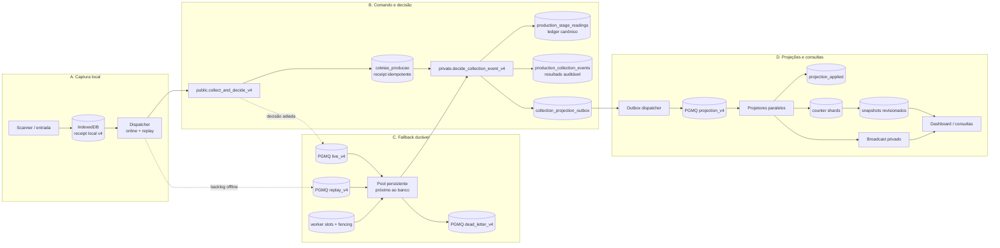

# ADR-0006 — MES Collection Fabric v4 com CQRS leve

**Status:** Proposta — **NO-GO para ativação, canário ou merge produtivo**
**Data:** 2026-09-04
**Escopo:** captura, decisão produtiva, fallback durável, projeções e consultas do AC-Prod2
**Base auditada:** `main` em `9174c796df4fa008507e727eb35cce63b3e4a08f`
**Projeto Supabase:** `uozuzdfvnufsjsonswag`, `sa-east-1`, PostgreSQL 17.6
**Decisores requeridos para aceitação:** Arquitetura, Produção/MES, Segurança, Operações e responsável formal pelo GO

## 1. Resumo da decisão

Propõe-se uma nova `pipeline_version = 4` para a coleta produtiva, implementada como CQRS leve em quatro limites:

- **A. Captura local:** persistência transacional no IndexedDB antes da primeira tentativa de rede;
- **B. Comando e decisão produtiva:** receipt idempotente e decisão mínima síncrona, ambos no PostgreSQL;
- **C. Processamento durável de fallback:** PGMQ e pool persistente de workers com slots, lease renovável e fencing;
- **D. Projeções e consultas:** transactional outbox, projetores paralelos, counter shards, snapshots versionados e Supabase Realtime Broadcast privado.

O PostgreSQL/Supabase permanece o sistema de registro. `production_stage_readings` permanece o ledger produtivo canônico. Não será implantado event sourcing completo e não serão introduzidos Redis, Kafka ou RabbitMQ sem evidência de que PostgreSQL + PGMQ + outbox falham no envelope de capacidade homologado.

A v4 terá funções, contratos, flags e rollout próprios. A semântica da `pipeline_version = 3` não será alterada silenciosamente. Evento que teve uma tentativa incerta permanece fixado ao pipeline original, e o mesmo `client_event_id` nunca pode produzir efeito canônico em dois pipelines.

Esta ADR registra a direção proposta. Ela não constitui GO. O **aceite
arquitetural para implementar** depende do encerramento da Fase Zero, schema
reproduzível, staging representativo e inventário de segurança/fluxos completo.
O **GO de release** é uma decisão posterior e depende da implementação testada,
capacity runs imutáveis e de todos os gates. Aceitar o desenho não autoriza
ativação, canário ou merge produtivo.

## 2. Contexto

O AC-Prod2 já possui componentes corretos que devem ser preservados:

- IndexedDB offline-first;
- `client_event_id`, `device_id` e `device_sequence`;
- receipt em `coletas_producao`;
- ledger em `production_stage_readings`;
- resultado/auditoria em `production_collection_events`;
- tentativas em `collection_processing_attempts`;
- transactional outbox;
- PGMQ com filas live, replay, projection e dead letter;
- counter shards e snapshots;
- Supabase Realtime Broadcast;
- feature flags e `pipeline_version` fixada por evento;
- runbooks e testes de capacidade iniciados.

A auditoria de 2026-09-04, contudo, confirmou que a implementação v3 ainda não fornece o caminho alvo:

- o ACK v3 inclui trabalho de fila, update e Broadcast após inserir receipts;
- a regra de decisão está embutida no processador batch, não em uma função canônica por receipt;
- o projetor processa efeitos compartilhados por item e conserva atualizações legadas no loop;
- a lease possui PK apenas em `worker_kind`, serializando cada tipo de worker;
- os consumidores principais são Edge Functions despertadas por HTTP/cron;
- não há tabela de slots nem fencing token;
- há 58 mensagens históricas de DLQ de projeção sem `reason_code`;
- `capacity_test_runs` está vazio;
- há grants, policies e SECURITY DEFINER que não atendem ao hardening requerido;
- os percentis disponíveis não satisfazem os SLOs e não pertencem a um run atual reproduzível.

Há também várias trilhas produtivas paralelas — entrada manual, volume não rastreável, reposição, retrabalho, rejeição, correção, embalagem, expedição, encerramento e importação PCP. A v4 não pode presumir que todos esses objetos são projeções descartáveis nem substituir tudo de uma vez.

## 3. Drivers da decisão

### 3.1 Integridade obrigatória

- zero perda de receipt;
- exatamente uma aprovação por peça, etapa normalizada e ciclo produtivo;
- resultado idempotente para retransmissão do mesmo evento;
- mesma decisão canônica no caminho síncrono, worker, replay e reconciliação;
- outbox comprometido na mesma transação da decisão;
- rollback que preserve receipts, ledger, outbox, filas, archives e DLQ;
- isolamento completo entre site/setor/célula;
- nenhuma aprovação emitida somente pelo cliente.

### 3.2 SLOs

- ACK local p95 <= 50 ms e p99 <= 100 ms;
- ACK durável no banco p95 <= 250 ms e p99 <= 500 ms;
- decisão p95 <= 500 ms e p99 <= 1.000 ms;
- projeção p95 <= 500 ms e p99 <= 1.000 ms;
- dashboard p95 <= 1.000 ms e p99 <= 2.000 ms;
- lock wait p95 <= 50 ms e p99 <= 200 ms;
- login p95 <= 1.500 ms e p99 <= 3.000 ms;
- zero logout involuntário;
- conexões sustentadas abaixo de 70% e pico abaixo de 85%;
- fila retorna ao baseline em até 60 segundos após burst.

### 3.3 Operação e evolução

- escalar horizontalmente sem limite de postos codificado no frontend;
- limitar concorrência pelo orçamento real de conexões, não por promessa de escala infinita;
- priorizar eventos live sobre replay sem causar starvation permanente;
- manter compatibilidade e rollout progressivo, observável e reversível;
- reduzir o trabalho compartilhado dentro do hot path;
- permitir reconstrução de KPIs sem apagar fatos produtivos;
- evitar uma conexão de banco por posto;
- usar Edge Functions como control plane, não como consumidor principal por evento.

## 4. Invariantes arquiteturais

As seguintes propriedades são parte do contrato e não opções de implementação:

1. O receipt é persistido antes de qualquer decisão produtiva e é único por `client_event_id`.
2. O par `(device_id, device_sequence)` é único quando informado.
3. Um `client_event_id` fica preso a uma única `pipeline_version` desde a primeira tentativa.
4. Reenvio com o mesmo `client_event_id` e o mesmo `payload_hash` retorna o resultado existente.
5. Reenvio com o mesmo `client_event_id` e payload diferente é conflito terminal e auditável.
6. Somente uma linha `approved` pode existir por `(piece_id, normalized_step_code, production_cycle)`.
7. Somente o banco pode devolver `APPROVED`; estado otimista local nunca gera som/cor de aprovação.
8. Toda regra produtiva converge para uma única função canônica privada.
9. Erro transitório pode adiar a decisão, mas não desfazer o receipt já confirmado.
10. Erro terminal não entra em retry infinito.
11. O ledger e o outbox são gravados na mesma transação da decisão.
12. Projeções são idempotentes, versionadas e reconstruíveis; fatos não são apagados para “zerar” KPI.
13. Perder slot, fencing token ou emergency-stop impede novas escritas do worker.
14. Falha de Broadcast não muda a decisão; o cliente detecta gap e refaz snapshot.
15. Rollback impede novos eventos v4, mas nunca move evento já decidido para v2/v3.

## 5. Decisão detalhada

### 5.1 Visão geral



### 5.2 Limite A — captura local

Antes da primeira tentativa de rede, uma transação IndexedDB grava:

- `schema_version`;
- `pipeline_version = 4`;
- `client_event_id` UUID imutável;
- `device_id` e `device_sequence` monotônica;
- `event_kind`;
- barcode/tag normalizado para transporte, sem decidir a peça localmente;
- `captured_at_client`;
- `trace_id`;
- payload mínimo e sanitizado;
- `payload_hash` calculado sobre representação canônica;
- `source_mode`;
- `batch_id` e `batch_sequence`, quando aplicáveis;
- `attempt_count`, último erro sanitizado e estado local.

JWT e token operacional não são copiados para cada evento. O cliente mantém a sessão Auth no mecanismo do SDK e uma referência segura à sessão operacional fora do payload da fila.

Estados locais permitidos:

`CAPTURED_LOCAL`, `PENDING_DATABASE`, `DATABASE_ACKNOWLEDGED`, `PROCESSING`, `APPROVED`, `REJECTED`, `BLOCKED`, `DUPLICATED`, `PENDING_REVIEW`, `RETRYING` e `DEAD_LETTERED`.

O dispatcher aplica:

- retry exponencial com full jitter;
- classificação terminal/transitória;
- consulta pelo mesmo `client_event_id` após resposta incerta;
- microbatches configuráveis;
- prioridade para captura online;
- backpressure explícita;
- limite configurável de fila local com alarme e bloqueio visível, nunca descarte silencioso;
- `pipeline_version` fixada antes da primeira chamada e imutável depois dela.

### 5.3 Limite B — comando e decisão produtiva

#### Wrapper público

O contrato proposto é um wrapper versionado, por exemplo:

```sql
public.collect_and_decide_v4(
  p_operator_session_token text,
  p_device_id text,
  p_schema_version integer,
  p_pipeline_version integer,
  p_client_event_id uuid,
  p_device_sequence bigint,
  p_event_kind text,
  p_barcode text,
  p_captured_at_client timestamptz,
  p_trace_id uuid,
  p_source_mode text,
  p_batch_id uuid,
  p_batch_sequence bigint,
  p_payload_hash text,
  p_payload jsonb
)
```

O nome e os tipos finais podem ser refinados antes da aceitação, mas qualquer alteração incompatível cria outro contrato versionado; não modifica v3.

O wrapper:

- é o menor possível;
- usa `SET search_path = ''` e nomes totalmente qualificados;
- revoga `EXECUTE` de `PUBLIC` e `anon`;
- concede apenas a `authenticated`;
- valida `auth.uid()` uma vez;
- valida tamanho, formato, UUID, timestamps, enumerações e limite de JSON;
- exige a `schema_version` suportada e `pipeline_version=4`, persistindo ambas;
- resolve sessão, device, célula, setor e permissão no servidor;
- não aceita `operator_id`, `cell_id`, `machine_id`, `lot_id`, etapa ou resultado como autoridade do cliente;
- persiste site/setor, operador, sessão, célula, máquina, lote, turno e rota
  resolvidos pelo servidor;
- recalcula `payload_hash` no servidor com canonicalização versionada e compara
  com o valor local; o hash enviado pelo cliente nunca é autoridade;
- valida `batch_id`/`batch_sequence` como par e sua pertença ao contexto quando
  aplicáveis;
- sanitiza erros e não devolve PII;
- mede cada etapa com `trace_id` e `client_event_id`.

Se o wrapper precisar de privilégios de definer para chamar `private`, ele deve ser `SECURITY DEFINER` com owner dedicado e sem privilégios desnecessários. A necessidade deve ser justificada. A implementação privada não recebe grant direto de papéis de cliente.

#### Hash canônico

O formato inicial é `mes-command-json-v1`: objeto UTF-8 com chaves ordenadas
recursivamente, arrays preservando ordem, inteiros em base 10, strings JSON sem
normalização implícita de Unicode, `null` preservado e floats proibidos no
payload produtivo. O documento inclui `schema_version`, `pipeline_version`,
`device_id`, `device_sequence`, `event_kind`, barcode/tag normalizado,
`captured_at_client`, `source_mode`, batch e payload sanitizado; exclui
`client_event_id`, `trace_id` e dimensões resolvidas pelo servidor. SHA-256 em
hex minúsculo é persistido como `payload_hash`.

`mes-command-json-v1` ainda não está apto a ingress antes de fixar dois detalhes
byte a byte: `captured_at_client` será serializado em UTC/RFC 3339 com precisão
única declarada, e barcode/tag usará um algoritmo nomeado e versionado. O código
atual combina `btrim` com caminhos que também aplicam `upper`, portanto a ADR não
escolhe essa semântica por memória. A migration de contrato deve registrar
algoritmo, Unicode/case/whitespace e precisão temporal exatos; vetores comuns de
browser e PostgreSQL são gate obrigatório. Alterar qualquer um deles exige nova
`schema_version`.

Browser e PostgreSQL terão os mesmos vetores públicos de teste. O banco monta e
hasheia novamente o documento validado; não confia no hash recebido. Qualquer
mudança nessa canonicalização exige nova `schema_version`, sem reinterpretar
receipts existentes.

#### Avaliador compartilhado e shadow sem efeito produtivo

Para não duplicar a regra de domínio nem transformar shadow em escrita
canônica, dois loaders server-side produzem o mesmo tipo privado imutável
`private.collection_candidate_v4`: um parte de um receipt v4 produtivo; o
outro parte de uma observação shadow separada. A lógica de avaliação recebe
esse candidato, não um identificador que obrigue shadow a tomar posse do
receipt:

```sql
private.evaluate_collection_candidate_v4(
  p_candidate private.collection_candidate_v4,
  p_evaluation_revision integer
)
```

O loader produtivo resolve o candidato a partir de
`coletas_producao`. O loader shadow grava primeiro uma cópia sanitizada,
gerada no servidor, em `private.collection_shadow_observations_v4`, com
`shadow_observation_id` próprio e referência ao pipeline/evento de origem.
Essa tabela não possui FK/trigger que crie ledger, outbox ou fila produtiva e
não usa `client_event_id` como chave de ownership.

A observação registra `state_revision` e o fingerprint das precondições no mesmo
ponto lógico da decisão legacy: imediatamente antes de seus efeitos produtivos,
sob a mesma visão transacional e ordem de locks. Legacy e v4 são comparados
contra esse candidato imutável; o evaluator não relê estado já alterado pelo
commit legacy. Se o hook não capturar o estado anterior atomicamente, ou se a
revisão/fingerprint divergir, o caso vira `INCONCLUSIVE_RACE` e não entra na
taxa de paridade. Assim uma aprovação legacy não faz o shadow parecer
falsamente `DUPLICATED`.

O evaluator resolve a decisão candidata e suas evidências, mas não insere
ledger, resultado produtivo, outbox ou projeção. A função canônica abaixo
adquire locks, recarrega/revalida o receipt dentro da transação e é a única que
materializa efeitos. Shadow chama somente o loader/evaluator de observação e
grava a comparação em tabela shadow separada, sem `receipt_id` ou
`reading_id` canônico. Divergência é telemetria; nunca altera o resultado
legacy.

#### Função canônica privada

Toda decisão converge para:

```sql
private.decide_collection_event_v4(
  p_receipt_id uuid,
  p_mode text
)
```

`p_mode` identifica `synchronous`, `fallback`, `replay` ou `reconciliation` apenas para controle/autoria/métrica. Ele não altera as regras de domínio nem permite que o mesmo evento produza resultados diferentes. `shadow` não é um valor permitido: shadow usa o evaluator sem efeitos descrito acima.

A função canônica:

1. carrega e valida o receipt v4;
2. retorna resultado existente se terminal ou já decidido;
3. resolve peça, rota e contexto antes de escrever;
4. ordena IDs quando houver mais de uma peça;
5. adquire apenas locks estritamente necessários, sempre na mesma ordem;
6. usa `lock_timeout` curto, mensurado e diferente de `statement_timeout`;
7. valida etapa anterior, ciclo, lote, contexto e permissões;
8. tenta inserir o ledger sob a barreira física normalizada;
9. cria resultado auditável;
10. insere outbox na mesma transação;
11. atualiza o receipt com decisão, timestamps e versão da regra;
12. retorna uma resposta tipada e estável.

Todos os quatro modos produtivos usam esta mesma função. Ela chama o evaluator
compartilhado, mas não aceita resultado calculado pelo cliente nem por outro
pipeline.

#### Barreira física durante coexistência

A v4 não pode coexistir em escrita apenas com uma convenção de nomes. Antes de
habilitar ingress, será executada uma estratégia expand/validate:

1. adicionar `normalized_step_code` nullable ao ledger e uma função privada
   de normalização versionada e determinística sobre a etapa/rota resolvida no
   servidor;
2. fazer backfill em staging, detectar colisões e revisar cada exceção sem apagar
   readings;
3. revogar INSERT/UPDATE direto de `anon`/`authenticated` no ledger antes
   da coexistência; clientes não podem fornecer ou escolher a chave
   normalizada;
4. adaptar todos os writers server-side autorizados — wrappers v2/v3,
   reposição, correção e v4 — para derivar a mesma chave no banco; trigger ou
   constraint rejeita valor nulo/divergente e alteração posterior;
5. criar e validar a unicidade parcial
   `(piece_id, normalized_step_code, production_cycle) WHERE status='approved'`;
6. impedir aprovação com chave nula depois da validação;
7. manter a barreira runtime anterior enquanto houver reader/writer legacy
   dependente, sem recriar a definição histórica obsoleta sem ciclo.

Nenhuma flag de escrita v4 pode ser ligada enquanto um writer paralelo puder
aprovar sem essa barreira. Se um adapter legacy não puder ser tornado
compatível, o escopo correspondente permanece fora do canário.

#### Transação do fast path

O wrapper executa:

1. validação barata de input;
2. resolução única de Auth e sessão;
3. `INSERT ... ON CONFLICT` do receipt;
4. verificação de `pipeline_version` e `payload_hash` no conflito;
5. bloco PL/pgSQL com handler de exceção — uma subtransação implícita —
   chamando a função canônica, com o receipt inserido fora desse bloco;
6. orçamento inicial de staging `sync_decision_budget_ms=150` e
   `piece_lock_timeout_ms=50`, conferido antes de cada fase limitada;
7. retorno final se a decisão couber nesse orçamento;
8. ao esgotar o orçamento, a função lança a exceção tipada v4 `P4B01`; o
   handler desfaz implicitamente apenas o bloco de decisão, registra a tentativa
   e enfileira a referência no escopo externo;
9. em erro interno allowlisted, entregue e capturado pelo mesmo handler antes
   do commit externo, o mesmo fallback transacional;
10. em erro terminal, resultado terminal sem retry infinito.

O alvo de commit server-side do receipt é 180 ms, deixando margem para o SLO de
DB ACK de 250 ms. Esses valores são candidatos para staging, não capacidade
homologada. A checagem entre fases e o lock timeout limitam o caminho esperado;
se uma consulta individual ultrapassar o orçamento, o run reprova o gate e o
timeout não é aumentado para mascará-la.

A função não executa `SAVEPOINT`, `ROLLBACK TO` ou `RELEASE SAVEPOINT`:
PL/pgSQL não suporta esses comandos. O bloco `BEGIN ... EXCEPTION ... END`
forma a subtransação implícita. O handler é explícito por SQLSTATE/reason code;
não existe `WHEN OTHERS` que converta erro desconhecido em fallback.

O cliente considera `DATABASE_ACKNOWLEDGED` somente depois de receber confirmação
de que a transação de receipt e, quando aplicável, enqueue foi comprometida.
Perda de resposta, cancelamento do comando, falha de conexão ou erro no commit
nunca permitem afirmar que o receipt foi preservado: o cliente consulta o mesmo
`client_event_id` e, se ausente, reenvia exatamente o mesmo comando/ID/pipeline.

No hot path não entram cálculo completo de KPI, scans amplos, dashboard, materialized view, PDF/Excel, notificação, IA, exportação, Broadcast nem refresh global de cache.

#### SQLSTATE

Há duas classes operacionais distintas:

- fallback dentro do mesmo RPC só admite `P4B01` ou erro surgido dentro do
  bloco com handler, capturado antes do commit externo e comprovado em staging
  como seguro. A lista de erros de banco começa com `55P03`; `40P01` e `57014`
  só entram após teste que prove o ponto de entrega, rollback da subtransação
  implícita e validade da transação externa;
- retry da transação/requisição inclui `40001`, classe `08`, erro no commit e
  conexão/resposta incerta. Nesses casos não existe promessa de receipt/enqueue
  preservado: primeiro se reconcilia, depois se repete o mesmo
  `client_event_id` se necessário.

Falhas de capacidade como `53300` acionam admission control/backoff; não são
convertidas cegamente em mais concorrência. O mesmo SQLSTATE observado fora do
ponto homologado segue o caminho incerto, não o fallback interno.

Autorização, input inválido, peça/rota inexistente, etapa não permitida, conflito de payload, contexto incompatível e regra de domínio são terminais. `WHEN OTHERS` nunca converte erro desconhecido em aprovação ou retry infinito; o erro desconhecido é sanitizado, registrado e bloqueia o evento para revisão.

### 5.4 Limite C — fallback PGMQ e pool horizontal

#### Filas v4

A v4 cria nomes próprios:

- `collection_live_v4`;
- `collection_replay_v4`;
- `collection_projection_v4`;
- `collection_dead_letter_v4`.

Mensagens transportam referência mínima ao receipt/outbox, `client_event_id`, `first_seen_at`, contador, versão e contexto técnico sanitizado. O payload produtivo completo permanece no banco protegido por RLS/grants.

O consumo usa `read` com visibility timeout, renovação via `set_vt` em operações longas, commit idempotente e `archive` somente depois do commit. Se o worker morrer após commit e antes de archive, o reprocessamento encontra o resultado/applied marker e arquiva sem duplicar efeito.

Após o máximo configurado de tentativas, a DLQ recebe:

- `reason_code` obrigatório;
- `first_seen_at` e `last_seen_at`;
- `last_sqlstate`;
- origem e ID da mensagem;
- `client_event_id`;
- payload sanitizado;
- versão do worker e commit.

Live tem peso inicial 4 e replay peso 1. Além do weighted scheduling, ao menos um slot/cota de batch permanece disponível a live quando houver backlog, para impedir que replay offline monopolize o pool.

#### Slots e fencing

A lease global é substituída por tabela aditiva, por exemplo:

```text
private.collection_worker_slots
  worker_kind
  slot_id
  lease_owner
  fencing_token
  acquired_at
  heartbeat_at
  expires_at
  metadata
  PRIMARY KEY (worker_kind, slot_id)
```

`fencing_token` é monotônico por aquisição. Toda RPC de claim/process/finalize recebe `worker_kind`, `slot_id`, `lease_owner` e `fencing_token`, e rejeita escrita se:

- o owner não corresponde;
- o token está obsoleto;
- o lease expirou;
- o heartbeat não foi renovado;
- emergency-stop está ativo;
- a pipeline/worker version não é permitida.

O fencing é validado no servidor na mesma transação da escrita, não apenas no processo do worker. Assim, uma instância pausada ou particionada não continua gravando depois de perder o slot.

A linha do slot nunca é apagada para liberar capacidade. Release limpa owner e
lease, preserva o último token e não faz reset. Cada aquisição usa `nextval` de
uma sequence privada, sem `CYCLE`, com grants de cliente revogados; sequence não
reverte o número consumido em rollback e sobrevive a restart. Portanto um token
que possa ter sido observado jamais é reutilizado, e o par
`(worker_kind, slot_id, fencing_token)` só avança.

Cada worker persistente:

- possui `instance_id` único;
- adquire um slot livre com operação atômica;
- mantém heartbeat e renova a visibilidade quando necessário;
- processa microbatches set-based;
- encerra imediatamente novos claims ao perder slot ou receber emergency-stop;
- conclui de forma graciosa apenas o trabalho que ainda possui fencing válido;
- não mantém transação aberta durante I/O externo;
- não mantém lock aguardando rede;
- publica métricas por batch;
- libera slot ao terminar.

Os workers rodam próximos à região do banco, com pool fixo e limitado. Edge Functions permanecem para health, control plane, wakeup não crítico, sweeper e ações administrativas. Elas não são o consumidor principal por evento.

### 5.5 Limite D — projeções, snapshots e Broadcast

#### Transactional outbox

A decisão insere o outbox na mesma transação do ledger e resultado. Um dispatcher persistente e idempotente move referências pendentes para `collection_projection_v4`. O outbox continua sendo a prova da intenção mesmo se o dispatcher ou a fila falhar.

O dispatcher trava o outbox pendente, chama `pgmq.send` e grava
`queue_msg_id`, `dispatch_key` e estado `queued` na mesma transação PostgreSQL;
mark e send nunca são commits separados. Se essa transação reverter, nem a
mensagem nem o marker ficam visíveis. `dispatch_key` é único por
`(outbox_id, projection_revision, projection_kind)` e o projector mantém marker
idempotente, protegendo também o caso de commit incerto/reconciliação. Um
sweeper recupera outbox sem mensagem; cron é apenas fallback. A atomicidade e o
retry após commit incerto são testes obrigatórios antes do canário.

#### Projetores

Projetores leem PGMQ em batch, carregam outbox e aplicam deltas agrupados por:

- site/setor;
- célula;
- máquina, quando aplicável;
- operador e sessão operacional;
- janela de turno;
- lote;
- batch/import;
- step code normalizado;
- metric code;
- production cycle;
- shard.

O applied marker possui unicidade física:

```text
(client_event_id, projection_revision, projection_kind)
```

O shard é determinístico:

```text
stable_hash(client_event_id) % shard_count
```

`stable_hash` é definido no servidor e testado entre versões. `shard_count` fica versionado na configuração da projeção e não muda sem migração, dual-read/backfill e reconciliação.

Cada batch:

1. valida fencing do projetor;
2. elimina itens já aplicados;
3. agrega deltas por dimensões, shard e métrica;
4. faz upserts set-based;
5. grava applied markers e revisão;
6. atualiza snapshot/contexto;
7. marca outbox projetado;
8. compromete;
9. arquiva mensagens PGMQ após commit.

Não há um `UPDATE` de cada KPI para cada evento. Produção de lote e produção de turno são projeções distintas. Novo lote cria novo `context_id`; virada de turno cria novo `shift_window_id`; históricos permanecem preservados.

#### Snapshot de consulta

O contrato proposto, por exemplo `get_collection_dashboard_snapshot_v4`, devolve em uma leitura curta:

- `revision`;
- `generated_at`;
- `context_id`;
- KPIs de lote;
- KPIs de turno;
- KPIs de célula;
- saúde das filas;
- `last_applied_event_id`;
- `projection_lag_ms`.

Materialized views de um minuto podem permanecer para relatório histórico, não como mecanismo de tempo real da coleta.

#### Broadcast privado

Após projeção, uma notificação compacta é publicada em tópicos privados:

- `mes:<sector_id>:device:<device_id>`;
- `mes:<sector_id>:cell:<cell_id>`;
- `mes:<sector_id>:lot:<lot_id>`;
- `mes:<sector_id>:run:<run_id>`.

Payload permitido:

- `event_type`;
- `client_event_id`;
- `context_id`;
- `revision`;
- `decision_status` apenas no tópico do dispositivo autorizado;
- `changed_dimensions` mínimas;
- `server_timestamp`.

JWT, refresh token, token operacional, e-mail, matrícula, segredo e payload produtivo desnecessário são proibidos.

Broadcast é sinal de invalidação, não fonte de verdade. O dashboard recebe snapshot inicial, coalesce notificações por 100–250 ms e refaz um único snapshot. Gap de revisão dispara ressincronização. Polling fica desligado enquanto o canal está saudável, progride quando stale/desconectado e para após reconexão.

## 6. Auth, sessão operacional e PWA

### 6.1 Máquina de estados Auth

O frontend adota:

`INITIALIZING`, `AUTHENTICATED`, `DEGRADED_NETWORK`, `REFRESHING`, `REAUTH_REQUIRED` e `SIGNED_OUT`.

Regras obrigatórias:

- timeout de profile, HTTP 5xx, queda Realtime e falha de heartbeat não chamam `signOut`;
- unmount de página não encerra Auth nem sessão operacional automaticamente;
- fetch de profile/assignments é single-flight e tem cache coerente;
- refresh de JWT é propagado ao Realtime antes de resubscribe;
- logout explícito incrementa `session_epoch` e cancela operações antigas;
- uma resposta antiga não restaura sessão após logout;
- heartbeat operacional é separado da sessão Auth;
- falha transitória de heartbeat resulta em `DEGRADED_NETWORK`;
- reconnect usa backoff, jitter e coordenação entre abas;
- PWA update não recarrega durante captura ativa.

### 6.2 Cliente Supabase e canais

A aplicação mantém um único Supabase client por contexto de execução e um registry central de canais com:

- deduplicação;
- reference counting;
- resubscribe;
- propagação do JWT renovado;
- backoff com jitter;
- snapshot inicial;
- detecção de gap;
- limpeza explícita somente quando o último consumidor sai.

Nenhum componente cria canal em cada render. Falha de socket nunca é traduzida em logout.

### 6.3 UX de coleta

O operador vê estados distintos para coleta local, receipt no banco, processamento, aprovação, bloqueio, duplicidade, offline, backlog e intervenção. Apenas `APPROVED` confirmado pelo banco gera feedback de aprovação.

Resposta incerta não cria novo UUID, não troca pipeline e não aprova localmente. O cliente consulta o receipt original e reconcilia o estado IndexedDB.

## 7. Segurança

### 7.1 Fronteiras de confiança

O cliente não determina `operator_id`, `cell_id`, `machine_id`, `sector_id`, `lot_id` final, `shift_window_id`, permissão, etapa autorizada ou resultado. O servidor resolve esses valores a partir de Auth, sessão operacional, assignments, contexto ativo, peça, lote e roteiro.

Toda função pública ou privada privilegiada deve:

- justificar `SECURITY DEFINER`;
- usar `SET search_path = ''`;
- qualificar todos os objetos;
- revogar `PUBLIC`;
- conceder apenas ao papel necessário;
- validar role, permission, sessão, device e setor;
- limitar input JSON e arrays;
- não refletir SQL/PII em mensagens de erro;
- ter testes positivos, negativos, anon e cross-sector.

Grants de `TRUNCATE`, `DELETE`, `TRIGGER` e `REFERENCES` são removidos de `anon`/`authenticated` onde não há caso explícito. RLS é mantida e otimizada com `(select auth.uid())`/`(select auth.jwt())` quando apropriado.

### 7.2 Identidade de worker

Workers usam identidade própria, credencial armazenada no Vault, expiração e rotação. Se HTTP for mantido no control plane:

- não há CORS público; endpoints servidor-servidor não precisam de `Access-Control-Allow-Origin: *`;
- a origem é allowlist explícita quando um browser administrativo for realmente necessário;
- autenticação usa JWT/HMAC de serviço de curta duração;
- cada requisição carrega timestamp e nonce;
- nonce é consumido uma vez dentro de janela curta;
- há rate limit, audit log sanitizado e proteção contra replay.

Credencial, JWT ou chave do papel `service_role` e demais segredos nunca
entram no bundle/browser. O nome simbólico do papel pode constar em catálogo,
ACL e código de autorização auditado; isso não é material de autenticação.

### 7.3 Emergency-stop

Emergency-stop é server-side, versionado e auditado. Ele bloqueia novos claims e novas decisões v4, preservando transações já comprometidas. Workers validam o stop junto com o fencing antes de cada batch e antes de qualquer finalize.

## 8. Observabilidade e evidência de capacidade

### 8.1 Correlação

Devem ser correlacionados:

`trace_id`, `client_event_id`, `device_id`, `operator_session_id`, `receipt_id`, `queue_msg_id`, `worker_instance_id`, `worker_slot`, `fencing_token`, `projection_revision`, `broadcast_revision`, `capacity_run_id`, `commit_sha` e `migration_version`.

W3C `traceparent` é propagado quando possível. PII não entra em baggage, métricas, logs ou Broadcast.

### 8.2 Spans mínimos

- `scanner.capture`;
- `indexeddb.persist`;
- `http.ingress`;
- `auth.resolve`;
- `receipt.insert`;
- `piece.resolve`;
- `piece.lock`;
- `domain.decide`;
- `ledger.commit`;
- `outbox.insert`;
- `queue.wait`;
- `worker.claim`;
- `worker.process`;
- `projector.apply`;
- `realtime.broadcast`;
- `ui.snapshot`;
- `ui.apply`.

### 8.3 Métricas mínimas

Coleta:

- `collection_local_ack_ms`;
- `collection_db_ack_ms`;
- `collection_decision_ms`;
- `collection_end_to_end_ms`;
- `collection_queue_wait_ms`;
- `collection_lock_wait_ms`;
- `collection_processing_ms`;
- `collection_retry_total`;
- `collection_duplicate_total`;
- `collection_error_total`.

Projeção/UI:

- `projection_lag_ms`;
- `broadcast_lag_ms`;
- `dashboard_apply_lag_ms`;
- `queue_depth`;
- `queue_oldest_age_ms`;
- `dlq_depth`.

Banco/Auth/Realtime:

- `db_connections_used`;
- `db_connection_saturation`;
- `pool_wait_ms`;
- `deadlocks_delta`;
- `statement_timeouts_delta`;
- `auth_login_ms`;
- `auth_refresh_ms`;
- `auth_refresh_error_total`;
- `auth_involuntary_logout_total`;
- `realtime_reconnect_total`;
- `realtime_stale_seconds`.

### 8.4 Capacity run imutável

Cada ensaio persiste configuração, ambiente, compute, pools, commit, migrations, versões de Edge/worker, thresholds, métricas, artefatos, hashes, início/fim, decisão, responsável e motivo de parada.

Após finalização, a linha não pode ser atualizada ou apagada; anexos são novos registros auditáveis. Métricas cumulativas do PostgreSQL são capturadas antes/depois e convertidas em deltas do run.

## 9. Orçamento de conexões e dimensionamento

O pool não é dimensionado por número de postos. Postos continuam usando a Data
API/PostgREST e não abrem conexões PostgreSQL próprias. Supavisor é contabilizado
separadamente para clientes/serviços que realmente usam conexão PostgreSQL
poolada; workers persistentes consomem apenas o orçamento reservado a eles.

Antes de configurar slots:

```text
available =
  max_connections
  - superuser_reserved_connections
  - reserved_connections
  - auth_budget
  - postgrest_budget
  - realtime_budget
  - maintenance_budget
  - safety_headroom

worker_slots_max =
  floor(worker_connection_budget / connections_per_worker)
```

Concorrência demandada é estimada por:

```text
required_slots ≈ arrival_rate × service_time / target_utilization
```

O valor efetivo é o menor entre `required_slots`, `worker_slots_max` e um limite homologado por testes. Cada processo usa pool pequeno e fixo; não cria pool por mensagem, função ou posto.

No baseline atual, `max_connections=60`, reserva de superuser=3 e Auth=10 conexões absolutas. Os budgets configurados de PostgREST, Realtime e manutenção ainda precisam ser medidos/obtidos; portanto esta ADR não fixa quantidade de slots.

Metas operacionais:

- uso sustentado <70%;
- pico <85%;
- zero `idle in transaction`;
- pool wait p95 <50 ms;
- sem starvation de Auth, Realtime e manutenção.

Auth migra de reserva absoluta para percentual somente depois de medir o compute e validar login/refresh sob coleta simultânea. Aumentar pool ou compute não substitui correção de regra, lock ou query.

## 10. Versionamento e compatibilidade

### 10.1 Por que v4

A proposta altera semanticamente a v3 em pontos fundamentais:

- decisão síncrona mínima no mesmo contrato de ingestão;
- função canônica privada compartilhada;
- receipt UUID/payload hash e estados revisados;
- slots/fencing em vez de lease global;
- novo applied marker e projeção set-based;
- namespace Realtime com setor;
- requisitos de segurança e observabilidade adicionais.

Logo, reutilizar `pipeline_version=3` seria incompatível e poderia fazer eventos antigos serem interpretados por regras novas. A implementação deve usar `pipeline_version=4` e flags independentes, por exemplo:

- `collection_pipeline_v4_shadow`;
- `collection_pipeline_v4_ingress`;
- `collection_pipeline_v4_sync_decision`;
- `collection_pipeline_v4_fallback_worker`;
- `collection_pipeline_v4_projection`;
- `collection_pipeline_v4_broadcast`.

Todas nascem `false`, com escopo vazio/NO-GO e trilha de auditoria.

### 10.2 Propriedade do evento

O receipt compartilhado conserva `UNIQUE(client_event_id)`. Ao encontrar conflito:

- mesma pipeline + mesmo hash: devolve estado/resultado existente;
- pipeline diferente: nunca chama a decisão v4; devolve o owner do pipeline ou estado de reconciliação seguro;
- mesmo ID + hash diferente: conflito terminal e auditado.

O IndexedDB nunca muda a versão depois de uma tentativa. Replay, fallback e reconciliação consultam a versão persistida no receipt, não uma flag atual.

Observações shadow não inserem nem reservam linha nesse receipt compartilhado,
não entram em PGMQ produtiva e não chamam `decide_collection_event_v4`. Elas
referenciam o evento legacy somente para comparação e ficam em namespace/chave
próprios; logo não reivindicam `client_event_id` nem podem produzir efeito.

### 10.3 Flows fora da coleta rastreável

Reposição, manual/não rastreável, retrabalho, rejeição, correção, embalagem, expedição, encerramento e PCP só migram após uma matriz de compatibilidade por fluxo definir:

- comando autorizado;
- fato canônico;
- chave idempotente;
- barreira física;
- efeitos de lote/turno;
- projeções;
- rollback;
- testes de segurança e concorrência.

Até lá, a v4 não duplica writes desses fluxos nem declara como reconstruível um objeto que mistura fatos e projeções.

## 11. Rollout e rollback

### 11.1 Rollout

1. **Shadow:** um hook server-side captura candidato, `state_revision` e
   precondições imediatamente antes da decisão legacy, sob a mesma visão
   transacional; cria `shadow_observation_id` separado e calcula sem inserir
   receipt, ledger, resultado produtivo, PGMQ ou projeção canônica. Corrida ou
   captura pós-efeito vira `INCONCLUSIVE_RACE`; divergências comparáveis são
   registradas.
2. **Canário:** uma máquina, uma célula, operadores autorizados e janela curta.
3. **Expansão:** 5%, 25%, 50% e 100% das máquinas elegíveis, com gate automático entre etapas.

Cada etapa requer novo `capacity_run_id`, reconciliação exata e aprovação formal. Nenhuma flag é ativada apenas porque a fila terminou vazia.

### 11.2 Rollback

1. desligar ingress v4 para novas capturas;
2. parar novos claims por flag/emergency-stop;
3. preservar decisões já comprometidas;
4. pausar Broadcast se ele for a causa;
5. drenar ou pausar projeção segundo o runbook;
6. preservar PGMQ, archive, DLQ, receipts, ledger e outbox;
7. nunca enviar a v2/v3 evento já decidido ou tentado de forma incerta na v4;
8. restaurar triggers somente após confirmar workers parados e fencing inválido;
9. reconciliar antes de declarar rollback concluído.

Migrations são aditivas. Remoção de compatibilidade, índice ou função só ocorre em fase posterior, depois de janela de observação e ADR de depreciação.

## 12. Alternativas consideradas

### 12.1 Otimizar a v3 sem mudar a versão

**Vantagens:** menos objetos novos e rollout aparentemente menor.

**Desvantagens:** altera o significado de eventos v3 já persistidos; mistura lease global com slots; dificulta rollback e pode permitir que o mesmo evento seja processado sob duas semânticas.

**Decisão:** rejeitada para mudanças incompatíveis. Correções estritamente compatíveis e de segurança podem ser portadas, mas o novo contrato é v4.

### 12.2 Manter apenas o worker assíncrono legado

**Vantagens:** menor mudança inicial e reuse integral do fluxo atual.

**Desvantagens:** um RPC por evento, cron/wakeup no caminho normal, queue wait incompatível com o SLO e projeções/efeitos misturados à decisão.

**Decisão:** rejeitada como arquitetura alvo; pode permanecer temporariamente para eventos fixados em v2.

### 12.3 Caminho exclusivamente síncrono, sem fila

**Vantagens:** fluxo conceitualmente simples e decisão imediata quando o banco está saudável.

**Desvantagens:** indisponibilidade transitória ou contenção vira perda de disponibilidade; replay offline compete diretamente; não há recuperação durável quando o orçamento expira.

**Decisão:** rejeitada. O sync fast path precisa de fallback durável idempotente.

### 12.4 Event sourcing completo

**Vantagens:** histórico uniforme e reconstrução teórica de todo estado.

**Desvantagens:** exigiria remodelar fluxos legados, embalagem, expedição, PCP e fatos manuais; amplia risco e prazo sem evidência de necessidade.

**Decisão:** rejeitada. A v4 usa ledger canônico + resultado + outbox, isto é, CQRS leve.

### 12.5 Kafka, RabbitMQ ou Redis

**Vantagens:** ecossistemas maduros para filas/streams e escala independente.

**Desvantagens:** nova infraestrutura, operação e consistência; não corrige regra lenta, locks, RLS, Auth ou conexão. Redis não pode ser fonte de aprovação.

**Decisão:** adiada. Reavaliar somente se testes demonstrarem throughput/retention/multirregião incompatíveis com PostgreSQL + PGMQ.

### 12.6 Edge Function como consumidor principal por evento

**Vantagens:** deploy simples e integração nativa com Supabase.

**Desvantagens:** cold/wakeup, pools repetidos, limite de duração, lease difícil e conexão menos previsível. O baseline já mostra execuções longas.

**Decisão:** rejeitada para data plane. Edge permanece no control plane.

### 12.7 Gateway industrial local imediato

**Vantagens:** ACK na LAN e resiliência a WAN.

**Desvantagens:** autoridade por site, split-brain, mTLS, backup, atualização de regras e reconciliação tornam a operação substancialmente mais complexa.

**Decisão:** adiada. Só propor outra ADR se o caminho cloud-first cumprir os SLOs na mesma região e a WAN da fábrica for isolada como causa do p99 >1 s.

## 13. Consequências

### 13.1 Positivas

- receipt e decisão têm semântica idempotente explícita;
- o caminho comum evita queue wait sem perder fallback durável;
- uma única função reduz divergência de regra entre sync, worker e replay;
- slots e fencing permitem escala horizontal controlada;
- projeções deixam de alongar a transação produtiva;
- snapshots e revisão tornam Broadcast recuperável;
- o pipeline é reversível sem reprocessar fatos no pipeline anterior;
- PostgreSQL/Supabase e o investimento existente são preservados.

### 13.2 Negativas

- coexistirão v2, v3 e v4 durante a migração;
- o schema ganha receipts/flags/filas/métricas versionados adicionais;
- fencing, dispatcher de outbox e workers persistentes aumentam complexidade operacional;
- a matriz de compatibilidade dos fluxos legados exige trabalho específico;
- observabilidade e testes de capacidade precisam ser implementados antes da otimização ser considerada concluída;
- o orçamento pequeno de conexões pode limitar slots até ajuste de compute/pools.

### 13.3 Riscos e mitigação

| Risco | Mitigação obrigatória |
|---|---|
| duas pipelines aprovarem o mesmo evento | receipt global único, pipeline fixa, barreira física normalizada e testes de colisão |
| worker antigo gravar após perder lease | fencing token validado na mesma transação da escrita |
| replay monopolizar a fila | pesos 4:1, reserva para live, microbatch e backpressure |
| Broadcast perdido | revisão monotônica, gap detection e snapshot |
| projeção duplicada após crash | applied marker único e archive após commit |
| payload igual com serialização diferente | canonicalização e `payload_hash` server-side validado |
| aumento de slots derrubar Auth/Realtime | orçamento de conexão e scale ladder com stop no primeiro gate |
| correção apagar histórico | delta compensatório; proibição de delete/reset de fatos |
| RLS lenta | initplan, índices medidos e redução de policies sobrepostas |
| rollout ficar irreversível | flags independentes, eventos sticky e migrations aditivas |

## 14. Plano de implementação após aceite arquitetural

1. resolver drift Git/runtime e capturar definições efetivas;
2. fechar os bloqueadores de grants, RLS, SECURITY DEFINER e CORS;
3. criar contrato/event schema v4, flags próprias e testes de compatibilidade;
4. instrumentar receipt, decisão, fila, projeção, Auth e Realtime;
5. implementar função canônica e wrapper em migrations aditivas;
6. implementar fallback PGMQ v4 e DLQ estruturada;
7. implementar slots, fencing, heartbeat e emergency-stop;
8. implantar workers persistentes em staging próximo ao banco;
9. implementar outbox dispatcher, projeção set-based, shards e snapshots;
10. implementar registry Realtime, revisão/gap e polling adaptativo;
11. portar seletivamente o hardening Auth/PWA da PR #63;
12. executar testes SQL, Vitest, integração e navegador;
13. executar smoke, idempotência, colisão, rota completa, nominal, burst, scale ladder e endurance;
14. reconciliar cada run e emitir GO/NO-GO independente;
15. executar shadow primeiro em staging; somente após o GO correspondente,
    iniciar shadow/canário produtivo na ordem aprovada.

## 15. Critérios para aceitar esta ADR

Antes de mudar o status de Proposta para Accepted:

- [ ] responsáveis de Arquitetura, MES, Segurança e Operações aprovam a decisão;
- [ ] definições runtime estão versionadas e reproduzíveis;
- [ ] matriz de compatibilidade cobre todos os fluxos produtivos;
- [ ] budget de conexões inclui Auth, PostgREST, Realtime, manutenção e headroom;
- [ ] ambiente staging é representativo e explicitamente autorizado para carga;
- [ ] estratégia de worker persistente e operação 24x7 está definida;
- [ ] regras de normalized step e production cycle estão formalizadas;
- [ ] política de capacidade, retenção e evidência imutável está aprovada;
- [ ] rollback foi ensaiado sem apagar fatos/mensagens;
- [ ] riscos residuais têm owner e prazo.

Mesmo após a ADR ser aceita, ativação produtiva permanece NO-GO até todos os testes e gates do rollout passarem.

## 16. Questões em aberto

- Qual runtime persistente e modelo operacional hospedarão workers na região do banco?
- Qual é o orçamento real de PostgREST, Realtime, manutenção e Supavisor no compute escolhido?
- A canonicalização `mes-command-json-v1` cobre todos os tipos de payload reais
  ou algum fluxo exige nova `schema_version` antes da implementação?
- Qual será a taxonomia final de `event_kind`, `reason_code` e resultados terminais?
- Quais objetos legados são fatos e quais partes podem virar projeção reconstruível?
- Como tratar e preservar os 471 receipts sem evento atual e as 58 DLQs históricas?
- Qual função de hash estável e qual `shard_count` serão congelados na projection revision inicial?
- Qual janela de endurance é operacionalmente aprovada: oito horas ou outra equivalente?
- Há evidência de WAN que justifique iniciar uma ADR separada para gateway local?

## 17. Relações e referências

Documentos desta auditoria:

- [AS-IS, dependências e fontes de verdade](01-as-is-and-dependencies.md)
- [Baseline do runtime e catálogo](02-runtime-baseline-and-catalog.md)
- [PR #63 e drift Git/runtime](03-git-pr63-and-runtime-drift.md)
- [Matriz de riscos](04-risk-register.md)
- [Plano de alteração e rollback](05-change-and-rollback-plan.md)
- [Evidência oficial da plataforma](07-official-platform-evidence.md)
- [Matriz de compatibilidade por fluxo](08-flow-compatibility-matrix.md)

Documentação oficial:

- [Supabase — Row Level Security](https://supabase.com/docs/guides/database/postgres/row-level-security)
- [Supabase — Realtime Authorization](https://supabase.com/docs/guides/realtime/authorization)
- [Supabase — Broadcast](https://supabase.com/docs/guides/realtime/broadcast)
- [Supabase — PGMQ Extension](https://supabase.com/docs/guides/queues/pgmq)
- [Supabase — Connection management](https://supabase.com/docs/guides/database/connection-management)
- [PostgreSQL 17 — Explicit Locking](https://www.postgresql.org/docs/17/explicit-locking.html)
- [PostgreSQL 17 — Transaction Isolation](https://www.postgresql.org/docs/17/transaction-iso.html)

## 18. Registro da decisão

No contexto de múltiplos postos industriais concorrentes, operação offline e SLOs subsegundo, diante de uma v3 com componentes úteis porém sem fast path canônico, pool horizontal e evidência de capacidade suficiente, propõe-se uma `pipeline_version=4` baseada em CQRS leve, PostgreSQL como sistema de registro, PGMQ como fallback durável e outbox/projeções idempotentes. Rejeitam-se mudança semântica silenciosa da v3, event sourcing completo e adoção prematura de broker externo. Aceita-se a complexidade de coexistência versionada, workers persistentes, fencing e observabilidade como custo necessário para integridade, reversibilidade e capacidade mensurável.

**Estado final desta revisão:** Proposta mantida; **NO-GO** até aprovação formal e evidência reproduzível dos gates.
