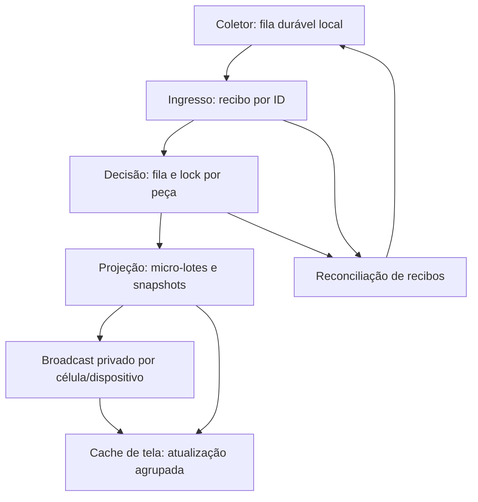

# Coletas: arquitetura e recuperação de capacidade

## Escopo e garantias

Correção validada inicialmente em `capacity-test` (`smnsihksrhzbkhcbdjfu`).
Nenhuma limpeza de IndexedDB, exclusão de coletas, troca de senha ou relaxamento
de RLS, SLO, timeout de banco ou política de inatividade faz parte desta mudança.
O banco principal não deve receber promoção da V3 somente porque testes unitários passaram.

A captura local, o recibo durável, a decisão e a projeção são confirmações diferentes.
Uma tela responsiva não é prova de gravação remota. Um ACK não é uma aprovação.
Uma aprovação não prova que todos os indicadores já foram projetados.

## Mudanças implementadas

| Camada | Controle |
| --- | --- |
| Captura | IndexedDB v4 preserva dados, claims e mudanças de estado atômicos; índices FIFO e por status |
| Transporte | Micro-lotes isolados por sessão/dispositivo/célula/máquina/pipeline; IDs preservados em resposta incerta |
| ACK | Exige recibo do ID correto, persistência explícita e horário real do servidor; sem sucesso por posição |
| Recuperação | Reconciliação V2/V3 rotativa, 100 recibos por página, timeout de 10 s; ACK tardio não regride decisão |
| Decisão | Atualização agregada do lote removida do caminho crítico V3; outbox gravado na mesma transação |
| Projeção | Até 5 eventos por transação, consolidação por escopo, cache de rota por importação e transação |
| Integridade | Efeitos, marcadores idempotentes e arquivamento da fila permanecem transacionais |
| Painéis | RPCs restauradas; snapshot do lote geral completo, não soma de caches parciais por máquina |
| Atualização | Janela fixa de 750 ms; GETs não se cancelam por evento; histórico lento não bloqueia KPIs |
| Sessão | Rede/503/429 não removem usuário validado; revogação, RLS, logout e inatividade continuam válidos |

Snapshots do lote geral possuem revisão do import para invalidar alterações externas.
Uma resposta transitória não vira zero artificial nem dispara download integral de peças/fatos
em cada navegador. Broadcast perdido é recuperado por consultas limitadas, sem reenviar
uma coleta já confirmada somente porque sua projeção atrasou.

## Evidências e interpretação

Auditoria de 06/09/2026: 763 eventos decididos, mas apenas 13 projetados; 750 projeções
aguardavam há dezenas de minutos. A fila de decisões estar vazia escondia esse problema.
`collection_stage_facts` é uma VIEW das leituras aprovadas: 725 = 725 não demonstrava
que histórico, ciclo de lote, counters e Broadcast estavam atualizados.

Comparação controlada de cinco projeções existentes, em transação revertida:
3.796,8 ms antes e 886,0 ms depois, redução aproximada de 76,7%. Um ciclo real completo
de cinco eventos confirmou 884,2 ms. Não são p95 de ingresso nem benchmark global.

Durante a validação, um UPDATE introduzido pelo patch foi recusado pela proteção
contra operações sem escopo (`21000`). Esse UPDATE foi corrigido sem desabilitar
a proteção. Trata-se de uma falha identificada na validação da mudança, não de
evidência de que todos os erros HTTP 500 históricos tinham essa mesma causa.
A recuperação automática foi observada após a correção; os scripts abaixo medem
seu término e erros recentes.

Recuperação concluída em 06/09/2026 às 22:47:22 UTC. Conferência às 22:48:22 UTC:
763 outboxes projetados, zero pendentes, zero DLQ e zero recibos V3 sem projeção.
As 725 leituras aprovadas possuem 725 lançamentos legados de produção. Dos 750
eventos represados, cinco foram finalizados no teste real controlado; os demais
745 escoaram pelos workers automáticos. Não houve nova leitura sintética nem
limpeza/reenvio manual da massa.

Durante o escoamento concorrente ocorreram retries por lock (55P03); não se deve
reportar erro histórico zero. Slots foram tornados não bloqueantes em seguida.
Particionar o claim de projeção por lote/importação é candidato para a próxima
rodada de carga caso a contenção de um mesmo escopo domine o throughput.

Estatísticas históricas de consultas, antes da correção, mostravam 4.700 consultas
do snapshot legado com média de 1.254,58 ms, máximo de 7.491,84 ms e aproximadamente
5.896,5 segundos de execução acumulada. Médias acumuladas não são percentis e não
devem ser comparadas como teste controlado de versões.

Após harmonizar a precedência da rota explícita sobre flags antigas, a aceitação
SQL transacional de 06/09/2026 validou os dois escopos abaixo. Nenhuma peça foi
alterada: as duas peças cuja rota não contém Corte deixaram de inflar seu previsto.
Cache frio e quente retornaram os mesmos totais; UPDATE local da revisão invalidou
o cache e todo o teste foi revertido. Anônimo, identidade ausente e KPI sem sessão
operacional ativa continuaram recusados.

| Célula | Previsto / aprovado / pendente | Snapshot frio | Snapshot em cache |
| --- | --- | ---: | ---: |
| Corte | 2113 / 725 / 1388 | 604,444 ms | 1,381 ms |
| Borda | 1880 / 0 / 1880 | 597,847 ms | 1,680 ms |

São medições controladas de chamadas SQL no servidor, não p95, tempo de rede,
renderização do navegador ou latência fim a fim de uma nova coleta. O cache foi
reaquecido às 22:55:46 UTC depois da validação.

## Aceitação operacional

1. Executar `supabase/tests/collection_capacity_observation.sql` e verificar outbox,
   recibos sem projeção, DLQ, timestamps finais e respectivos denominadores.
2. Executar `supabase/tests/collection_capacity_query_stats.sql` para separar ingresso,
   decisão, projeção e leitura. Não zerar estatísticas de outros usuários.
3. Verificar as respostas reais do worker: uma transação abortada pode deixar
   `attempt_count=0`, apesar de várias tentativas HTTP fracassadas.
4. Verificar dashboard e histórico por célula com sessão operacional válida.
5. Executar o roteiro k6 do runbook `collection-fabric-v3-deploy.md`, usando
   usuários, sessões e dispositivos distintos e pelo menos duas células.

## Limites não homologados

Os testes de capacidade nominal/burst precisam de fixtures e sessões obtidas pelo
login normal. Na auditoria não havia sessões operacionais ativas nem fixture k6
configurada. Não foram extraídas credenciais nem fabricadas identidades para contornar
essa ausência.

Ainda é necessário medir carga sustentada, reconexão do navegador, múltiplas abas,
expiração/renovação real do token e latência de regiões distantes. O teste k6 de API
não mede IndexedDB, renderização nem captura física. Estatísticas locais da UI ainda
leem histórico do dispositivo, embora agrupadas e fora do caminho de captura.
Se isso crescer, materializar contadores locais será a próxima otimização.

Não existe garantia de latência física zero nem capacidade ilimitada. A consistência
de uma mesma peça continua ancorada na região do banco, evitando aprovações conflitantes;
captura local durável e transporte assíncrono reduzem o impacto da distância.

## Referências primárias consultadas

- [Supabase: Broadcast e autorização](https://supabase.com/docs/guides/realtime/subscribing-to-database-changes)
- [Supabase: limites de escala de Postgres Changes](https://supabase.com/docs/guides/realtime/postgres-changes)
- [PostgreSQL: SKIP LOCKED para consumidores de filas](https://www.postgresql.org/docs/current/sql-select.html)
- [Supabase: sessões e renovação](https://supabase.com/docs/guides/auth/sessions)
- [Supabase: eventos de autenticação](https://supabase.com/docs/reference/javascript/auth-onauthstatechange)
